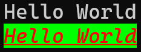
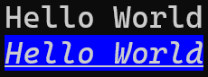
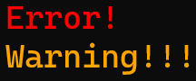
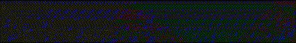

<h1 align="center">
	<br>
	<br>
	
	<br>
	<br>
	<br>
</h1>

[](https://www.npmjs.com/package/termic) 
[](https://www.npmjs.org/package/termic)
[](https://npmcharts.com/compare/termic?minimal=true)
[](https://packagephobia.now.sh/result?p=termic)
[](https://www.npmjs.com/package/termic?activeTab=dependents) 

<br>

## Highlights

- Expressive API
- Highly performant
- No dependencies
- Ability to nest styles
- [256/Truecolor color support](#256-and-truecolor-color-support)
- Auto-detects color support
- Doesn't extend `String.prototype`
- Clean and focused
- Actively maintained

## Install

```sh
npm install termic
```

## Usage

```js
const { cli, colors, styler } = require("termic");

cli.println("Hello World");

cli.println(styler.color(colors.red).background(colors.green).italic.underline("Hello World"));
```



Termic comes with an easy to use composable API where you just chain and nest the styles you want.

```js
const { cli, colors, styler } = require("termic");

const println = cli.println;

println("Hello World");

println(styler.background(colors.blue).italic.underline("Hello World"));
```



Easily define your own themes:

```js
const { cli, colors, styler } = require("termic");

const error = styler.color(colors.red);
const warning = styler.color(colors.orange);

cli.println(error("Error!"));
cli.println(warning("Warning!!!"));
```



Animations:

```js
const fs = require("node:fs");
const termic = require("termic");

const cli = termic.cli;
const styler = termic.styler;
const color = termic.colors;
const renderer = termic.renderer;
const animations = termic.animations;

const sourceFile = "example.txt";
const destFile = "example_copy.txt";

const progress_bar = renderer.progress(animations.animation1);
const progress_text = renderer.progress({ frames: ["Copying"] });
const progress_path_text = renderer.progress({ frames: [`${sourceFile} => ${destFile}`] });

const FAIL = styler.color([24, 24, 24]).background(color.red).bold(" FAIL ");
const DONE = styler.color([24, 24, 24]).background(color.green).bold(" DONE ");

fs.stat(sourceFile, function (err, stat) {
    const filesize = stat.size;
    let bytesCopied = 0;

    const readStream = fs.createReadStream(sourceFile)

    readStream.on('data', function (buffer) {
        bytesCopied += buffer.length;
        let porcentage = ((bytesCopied / filesize) * 100).toFixed(2);
        progress_bar.set(porcentage);
    });

    readStream.on('end', function () {
        progress_bar.end(DONE);
        progress_text.end(styler.color([86, 185, 127])("Copyed"));
        progress_path_text.end(styler.color([86, 185, 127])(`${sourceFile} => ${destFile}`));
    });

    readStream.on('error', function () {
        progress_bar.end(FAIL);
        progress_text.end(styler.color(color.red)("Error"));
        progress_path_text.end(styler.color(color.red)(`${sourceFile} => ${destFile}`));
    });

    readStream.pipe(fs.createWriteStream(destFile));
});

renderer.render([
    [styler.bold("Copying following files:")],
    [""],
    [" ", progress_bar, progress_path_text, progress_text, animations.simpleDots],
]);
```



## API

### termic.styler.`<style>[.<style>...](string)`

Example: `termic.styler.color(termic.colors.red).underline('Hello');`

Example: `termic.styler.color([255, 255, 255] /* white */).underline('Hello');`

### Modifiers

- `reset` - Reset the current style.
- `bold` - Make the text bold.
- `dim` - Make the text have lower opacity.
- `italic` - Make the text italic. *(Not widely supported)*
- `underline` - Put a horizontal line below the text. *(Not widely supported)*
- `doubleline` - Put a double horizontal line below the text. *(Not widely supported)*
- `inverse`- Invert background and foreground colors.
- `hidden` - Print the text but make it invisible.
- `crossedout` - Puts a horizontal line through the center of the text. *(Not widely supported)*
- `color` - Set text color
- `background` - Set background color

### Colors

- `black`
- `red`
- `green`
- `yellow`
- `blue`
- `magenta`
- `cyan`
- `white`
- `grey`
- `orange`

## Browser support

There is currently no browser version, but we are working on it

## Windows

If you're on Windows, do yourself a favor and use [Windows Terminal](https://github.com/microsoft/terminal) instead of `cmd.exe`.

## Maintainers

- [Shakhzodbek Utkurov](https://github.com/Shahzodbek2001)